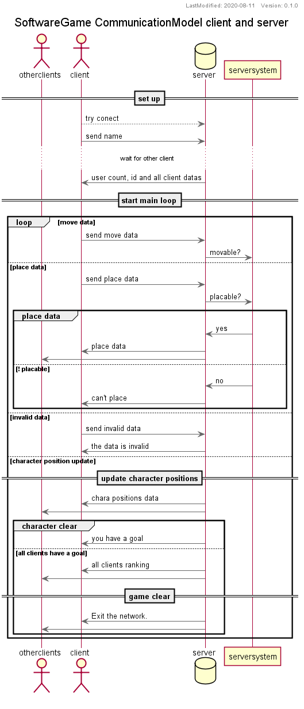

# ソフト実験

## 使用ライブラリ
- SDL2

## 使用文字コード
- UTF-8

## ネットワークモジュールのシーケンス図

## データフロー図

## オブジェクト図

### wiiリモコンに関するライブラリのインストール
- bluetooth関連

sudo apt-get install libbluetooth3 libbluetooth3-dbg libbluetooth-dev

- Down loadlibcwiimote

https://sourceforge.net/projects/libwiimote/files/libwiimote/0.4/

- 解凍

tar xvzf libwiimote-0.4.tgz && cd libwiimote-0.4

- 前準備

エディターでlibwiimote-0.4ディレクトリ内にある全ての"hci_remote_name"という記述を"hci_read_remote_name"に置き換える。
次に「config.mk.in」の中の"CFLAGS:=-Os -Wall -pipe $(DEFS) @CFLAGS@"を"CFLAGS:=-Os -Wall -fPIC -pipe $(DEFS) @CFLAGS@"にする。

- make

sudo apt-get install autoconf && autoconf && ./configure && make && sudo make install

- シンボルリンク

cd /usr/lib && sudo ln -s /usr/local/lib/libcwiimote.a libcwiimote.a && sudo ln -s /usr/local/lib/libcwiimote.so.0.4.0 libcwiimote.so
