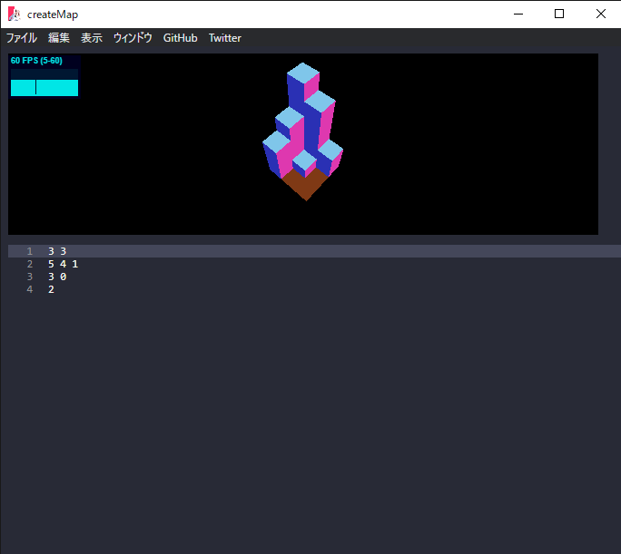

# createMap

## 使用手順
まずググってyarnをインストールしよう

createMapフォルダー内に移動する

yarn

yarn start

## 使用方法
ファイルを開くから.csvファイルを開く

適当に編集してはダメで、一行目にx,yの要素の数を示す必要がある.
要素数を増やしたいときはqriquriに言ってください.

ctrl+sか保存ボタンを押すとマップが更新される.

マウスドラッグで視点回転、マウスホイールで視点を前後に動かせる.

## 仕様
それぞれの数値はブロックの高さを表していることに注意してください。

# 素晴らしい！！！！！
